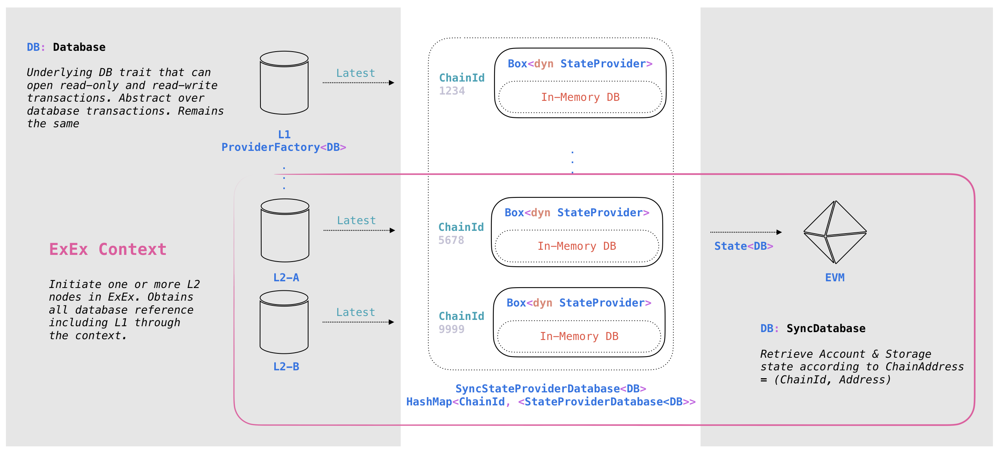

# gwyneth-mono

This repository showcase how Gwyneth builder builds and propose blocks in a local network, while Gwyneth client syncs and progress the states of multiple L2s. To spin up the network:
```
$ make install
```
This will setup 2 CL nodes with 2 EL nodes. The EL nodes each sync for two Gwyneth L2 networks, which synchronousely compose with each other, in addition to a rbuilder instance that builds both L2 chains. The rbuilder attaches to the first EL node similar to the MEV setup (without relays).
```
========================================== User Services ==========================================
UUID           Name                                             Ports                                                  Status
4d67bb4dd33e   blockscout-gwyneth-160010-postgres               postgresql: 5432/tcp -> postgresql://127.0.0.1:56603   RUNNING
d9b8ef46debb   cl-1-lighthouse-gwyneth                          http: 4000/tcp -> http://127.0.0.1:56584               RUNNING
                                                                metrics: 5054/tcp -> http://127.0.0.1:56585            
                                                                tcp-discovery: 9000/tcp -> 127.0.0.1:56586             
                                                                udp-discovery: 9000/udp -> 127.0.0.1:55988             
0768a915bb82   cl-2-teku-gwyneth                                http: 4000/tcp -> http://127.0.0.1:56588               RUNNING
                                                                metrics: 8008/tcp -> http://127.0.0.1:56589            
                                                                tcp-discovery: 9000/tcp -> 127.0.0.1:56587             
                                                                udp-discovery: 9000/udp -> 127.0.0.1:56075             
abb6e99b8769   el-1-gwyneth-lighthouse                          engine-rpc: 8551/tcp -> 127.0.0.1:32001                RUNNING
                                                                l2-rpc-160010: 10110/tcp -> 127.0.0.1:32005            
                                                                l2-rpc-160011: 10111/tcp -> 127.0.0.1:32006            
                                                                metrics: 9001/tcp -> http://127.0.0.1:32004            
                                                                rpc: 8545/tcp -> 127.0.0.1:32002                       
                                                                tcp-discovery: 32000/tcp -> 127.0.0.1:32000            
                                                                udp-discovery: 32000/udp -> 127.0.0.1:32000            
                                                                ws: 8546/tcp -> 127.0.0.1:32003                        
07d64b0239ec   el-2-gwyneth-teku                                engine-rpc: 8551/tcp -> 127.0.0.1:32008                RUNNING
                                                                l2-rpc-160010: 10110/tcp -> 127.0.0.1:32012            
                                                                l2-rpc-160011: 10111/tcp -> 127.0.0.1:32013            
                                                                metrics: 9001/tcp -> http://127.0.0.1:32011            
                                                                rpc: 8545/tcp -> 127.0.0.1:32009                       
                                                                tcp-discovery: 32007/tcp -> 127.0.0.1:32007            
                                                                udp-discovery: 32007/udp -> 127.0.0.1:32007            
                                                                ws: 8546/tcp -> 127.0.0.1:32010                        
bdcf74e73990   rbuilder-el-1-gwyneth-lighthouse                 <none>                                                 RUNNING
14176943d20d   validator-key-generation-cl-validator-keystore   <none>                                                 RUNNING
42f77bc618f6   vc-1-gwyneth-lighthouse                          metrics: 8080/tcp -> http://127.0.0.1:56602            RUNNING
```
Then deploy Gwyneth protocol and proceed proposing blocks for both L2s. This will also deploy helper contracts and several examples to call the `XCallOptions` precompiles, enabling synchronous composibility.
```
make run
```
Have fun 🍻.

## Change Log
### rbuilder
  
Gwyneth builder is a fork of [in-process rbuilder](https://github.com/flashbots/rbuilder). We made several modifications to make it compatible with L2 building:
- Using [handle of EthApi](https://github.com/ceciliaz030/rbuilder/blob/71c458940c878a7480d31ad4e23c9a1fb78a7f4a/crates/gwyneth-rbuilder/src/main.rs#L113
) for each L2 to obtain transactions instead of using ipc files, this remove the IO overhead and simplify configurations. However, this also needs an extract [struct implementation to expose inner function](https://github.com/ceciliaz030/gwyneth/blob/a121aa929f7789ee50275609ad3d5ae46720c942/crates/rpc/rpc/src/eth/pubsub.rs#L70) in reth so the TODO is make a PR to upstream.
- Adding [L1ParentStates](https://github.com/ceciliaz030/rbuilder/blob/71c458940c878a7480d31ad4e23c9a1fb78a7f4a/crates/rbuilder/src/live_builder/gwyneth.rs#L51) to force L2s sync to the latest L1 block, which pulls the latest DA from Gwyneth smart contract 
and then start building against recovered L2 states.
    - TODO: sometime ExEx will batch update L2 states, which cause the synced L1 parent > parent of current payload, we should either optimize so that ExEx syncs fast enough, or just build against the outdated state (current implementation, yolo) with revert protection.
- Reducing builder's [OrderSink](https://github.com/ceciliaz030/rbuilder/blob/71c458940c878a7480d31ad4e23c9a1fb78a7f4a/crates/rbuilder/src/live_builder/order_input/replaceable_order_sink.rs#L13); the builder adds a "sink" per chain for each FCU update. These sinks takes mempool transactions and starts the simulation jobs, thus there will be three building tasks given L1 + n L2s. We [remove the L1 sink & mempool subscriber](https://github.com/ceciliaz030/rbuilder/blob/a2ca78b73ca6cf8b4523fc5b10e675b2dda019a8/crates/rbuilder/src/live_builder/mod.rs#L126), and only send the [matching order down the correct L2 sink](https://github.com/ceciliaz030/rbuilder/blob/71c458940c878a7480d31ad4e23c9a1fb78a7f4a/crates/rbuilder/src/live_builder/order_input/orderpool.rs#L213). The order is [removed once it's sent](https://github.com/ceciliaz030/rbuilder/blob/71c458940c878a7480d31ad4e23c9a1fb78a7f4a/crates/rbuilder/src/live_builder/order_input/orderpool.rs#L211) to prevent repetative transactions in proposals. 
    - Crrently, cross-chain builder is not optimized for competitive block-building, so there's no need to build repetitvely or maximize MEV. Once we have [L2 PBS through an opt-in preconferer](https://ethresear.ch/t/rollup-centric-considerations-of-based-preconfimations/20160), the builder can then submit competitive blocks and proposer should select the best one, which prevents repetition in proposed batch. 
- Removing [repeated payload attributes](https://github.com/ceciliaz030/rbuilder/blob/a2ca78b73ca6cf8b4523fc5b10e675b2dda019a8/crates/rbuilder/src/live_builder/mod.rs#L189) when CL pushes repeated FCU, which further reduce redundent building threads.
- [Forbiding local building](https://github.com/ceciliaz030/gwyneth/blob/39b0850f36823cb530943b42028f8cbe1e7b5e10/crates/consensus/beacon/src/engine/mod.rs#L407) in reth for L1. The in-process builder node should only build for L2 in the rbuilder module, sync for L1 + L2s in reth module. The reth module should not issue task in its own [PayloadBuilderService](https://github.com/ceciliaz030/gwyneth/blob/c4886cbb59eee9ee3345c223c3e3b75bf91b514f/crates/payload/builder/src/service.rs#L210).

### reth
The reth has the implementation of [GwynethNode](https://github.com/ceciliaz030/gwyneth/blob/6a69113064cf54f9f73564dfa4b588a2d7dd773c/crates/gwyneth/src/lib.rs#L219), which mostly the same as the [EthereumNode](https://github.com/ceciliaz030/gwyneth/blob/a0091f76e58e5d2543734889918f057d7b32c2c8/crates/ethereum/node/src/node.rs#L37) except for how it builds cross-chain payload. Specifically, we have [GwynethPayloadAttributes](https://github.com/ceciliaz030/gwyneth/blob/6a69113064cf54f9f73564dfa4b588a2d7dd773c/crates/gwyneth/src/lib.rs#L70) and [GwynethPayloadBuilder](https://github.com/ceciliaz030/gwyneth/blob/6a69113064cf54f9f73564dfa4b588a2d7dd773c/crates/gwyneth/src/lib.rs#L261) that obtains transactions from attributes instaead of the mempool, then build with the [SyncStateProviderDatabase](https://github.com/ceciliaz030/gwyneth/blob/8c85f4cb08f9e677d31a06de7f76518e09d1204c/crates/gwyneth/src/builder.rs#L82) that accesses cross-chain states.
  
- The Node, Attributes, and PayloadBuilder is similar to the implementaions in the [OP-stack](https://github.com/ceciliaz030/gwyneth/blob/7d8196e29ca8427f48f18516963a6a5c3356ef44/crates/optimism/node/src/node.rs#L38) of reth.
- We modified the database interface of revm into [SyncDatabase](https://github.com/ceciliaz030/revm/blob/959611e7a6ceeb693acffe00ba8e4d976591479f/crates/primitives/src/db.rs#L48) to allow the EVM to access accounts with `ChainAddress`, a tuple of `(chain_id, address)`, so that EVM can execute against different chains. This also abstract away the 
concrete type of StateProviders for each database instances.
- For CLI, we added GwynethArgs as extension arguments of reth command. GwynethArgs allows user to specify L2 chain_ids, datadir, and ports. We also incorperated rbuilder cmd when being used as builder node.

To start a Gwyneth node with CLI:
```
 ./reth node --l2.chain_ids 123 456 --l2.datadirs /data/chain_a /data/chain_b/
 ```
 To start a Gwyneth builder node with CLI:
 ```
  ./reth node --l2.chain_ids 123 456 --l2.datadirs /data/chain_a /data/chain_b/ --rbuilder.config path/to/rbuilder.toml
 ```

### ethereum-packages
 We try to configure a base rollup network by encorperating Gwyneth in ethereum-packages. The advantage of this is 